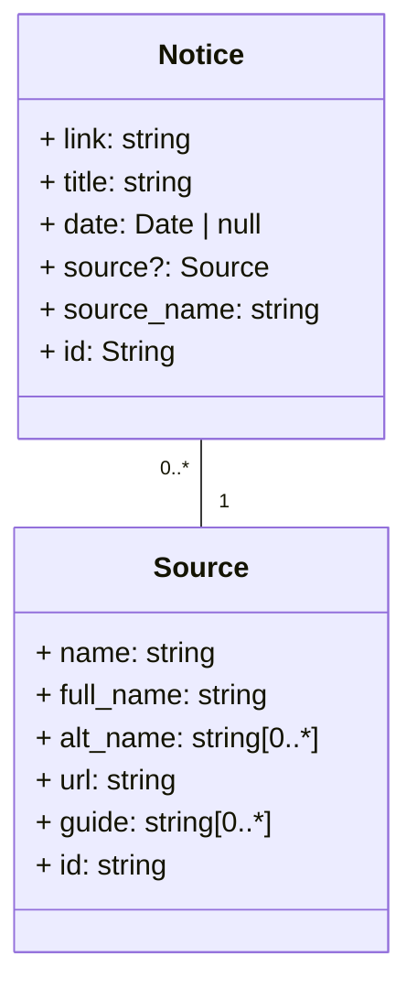

# Documentation

## Models

```mermaid
classDiagram
    class Notice {
        + link: string
        + title: string
        + date: Date | null
        + source?: Source
        + source_name: string

        + id: String
    }

    class Source {
        + name: string
        + full_name: string
        + alt_name: string[0..*]
        + url: string
        + guide: string[0..*]

        + id: string
    }

    Notice "0..*" -- "1" Source
```
