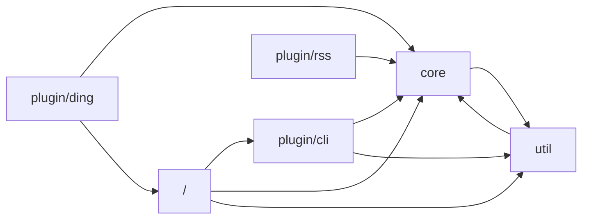
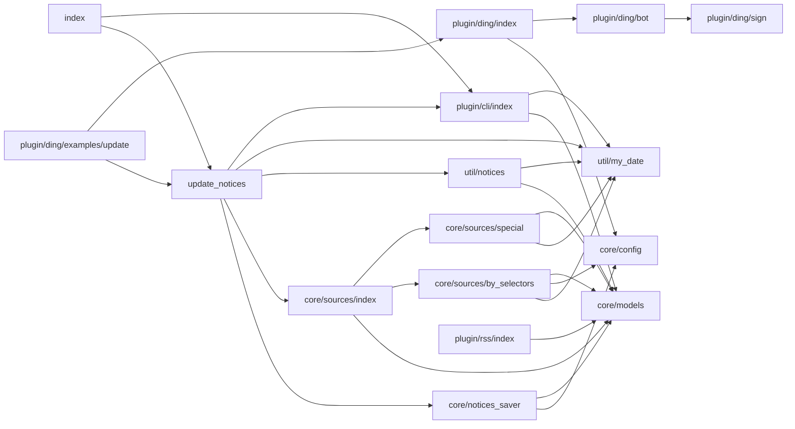
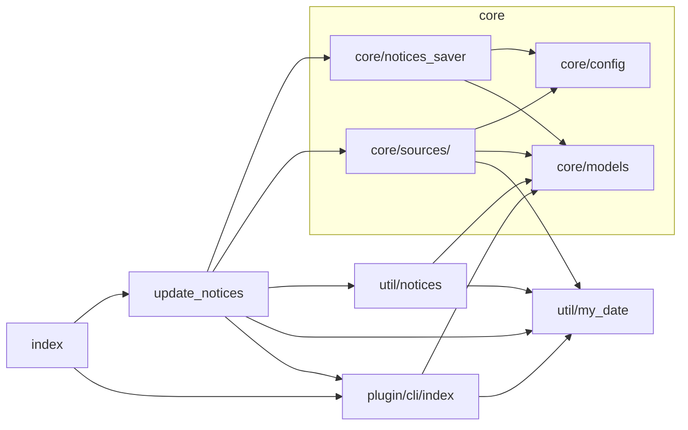
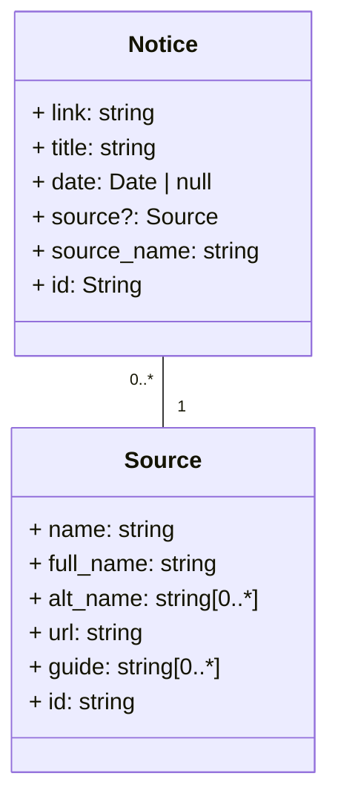

# Documentation

## 引用结构

> 此节仅适用于 [2a87d6af](https://github.com/YDX-2147483647/bulletin-issues-transferred/tree/2a87d6af693342ac8aceb7311077445367a60e33)（≈ v2.0.0-alpha.4）。

### `plugin`地位不清

存在越级引用、被引用。



### 文件夹不是模块

存在文件夹互相引用。而且没有封装，太散了。



去除`plugin/ding`和`plugin/rss`，合并`core/sources/`后如下。



## Models



## 备忘录

### 钩子

我们使用 [before-after-hook](https://www.npmjs.com/package/before-after-hook) 的`HookCollection`，请参考它的文档。

> [octokit.js](https://github.com/octokit/request.js) 也使用了`HookCollection`，亦可作参考。

```typescript
// 预留钩子示例

import type { HookCollection } from 'before-after-hook'

type HooksType = {
    foo: {
        Options: FooOptions
        Result: FooResult
    }
}

function _foo (options: FooOptions): FooResult {
    // …
}

export function foo ({ _hook, ...options }: {
    _hook: HookCollection<HooksType>
} & FooOptions): Promise<FooResult> {
    return _hook('foo', _foo, options)
}
```

```typescript
// 使用钩子示例

import { Hook } from 'before-after-hook'

const _hook = new Hook.Collection<HooksType>()
_hook.before('fetch', before_hook)

await foo({
    ...options,
    _hook
})
```

插件可以在 before hook 中向`options`添加自己的属性，供相应 after hook 使用。预留钩子时要避免把自定义属性传丢了。
