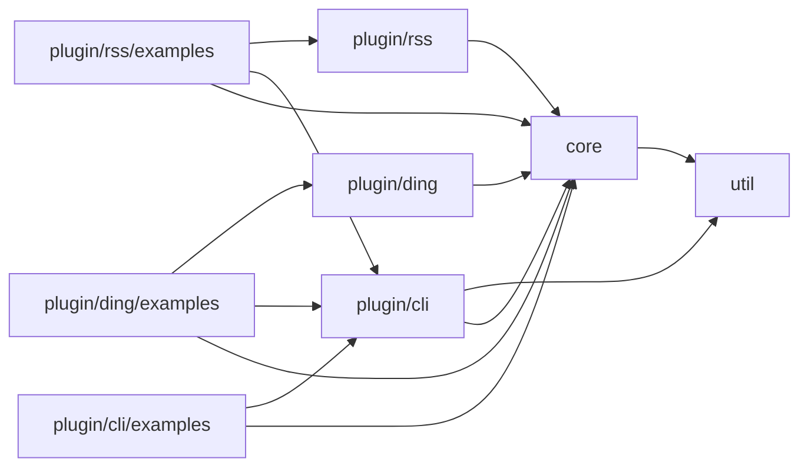
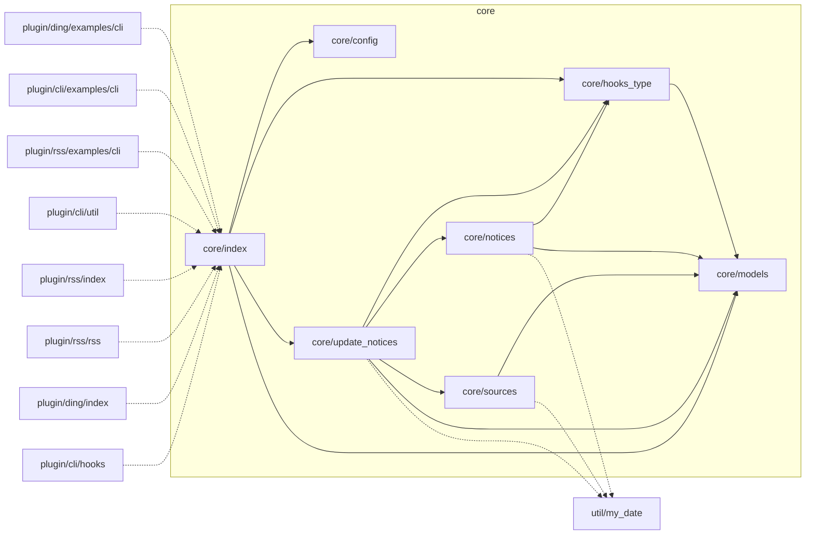
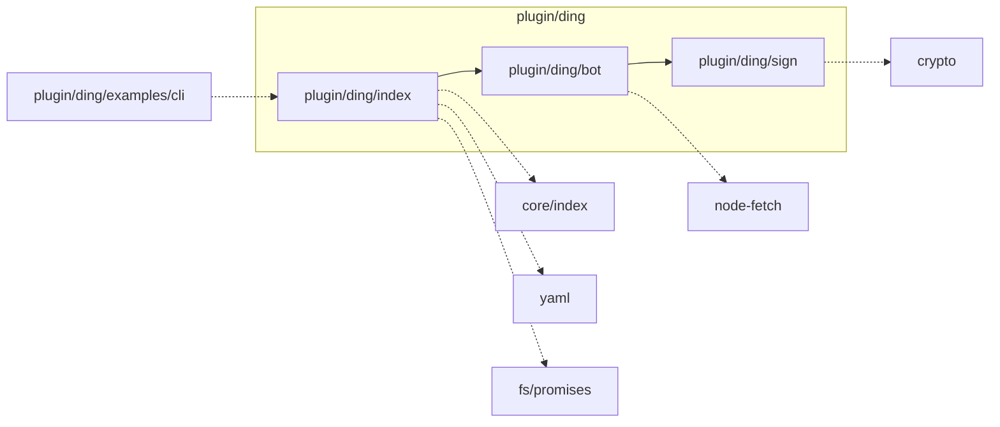

# Documentation

## 文件结构设计

> 当前正在重构，可能与设计不完全相同。

- 分工
  - `core`只涉及核心功能，不考虑命令行界面等，不能引用任何`plugin`。
  - `util`全部为纯函数，可单独测试，不能引用`core`或`plugin`。
  
- 配置文件
  - `core`内部模块不引入配置文件，而是把选项设计为参数。
  
  - 在最表层引入配置文件。
  
  - 配置文件（理论上）可被命令行参数替代。
  
  - `plugin`可以向配置文件中添加自己的键，但仍用`core`读取`config`。
  
    ```yaml
    # config.yml
    ding:  # plugin/ding 的配置
      secrets_path: config/ding.secrets.yaml
    ```
  
    配置的具体规定目前只加入`config/config.schema.json`，不加入`src/core/config.ts`。
  
- `core`中钩子
  - `core`内部模块通过参数`_hook`传入`hook`。
  - 在最表层`new Hook.Collection<HooksType>()`，并向外暴露`hook.api`。
  
- 尽量模块化
  - 隐藏模块内细节：`core`中每个文件夹都有`index.ts`，外部一律引用它。

---

可生成 [mermaid .js](https://mermaid-js.github.io/mermaid/#/) 的 flowchart，如下图。

```shell
$ python scripts/import_graph_mod.py
```



```shell
$ python scripts/import_graph_single.py core
```



```shell
# Turn on `case  LinkType.absolute` in `generate_markdown` in advance.
$ python scripts/import_graph_single.py plugin/ding
```



## Models


## 备忘录

### 钩子

我们使用 [before-after-hook](https://www.npmjs.com/package/before-after-hook) 的`HookCollection`，请参考它的文档。

> [octokit.js](https://github.com/octokit/request.js) 也使用了`HookCollection`，亦可作参考。

```typescript
// 预留钩子示例

import type { HookCollection } from 'before-after-hook'

type HooksType = {
    foo: {
        Options: FooOptions
        Result: FooResult
    }
}

function _foo (options: FooOptions): FooResult {
    // …
}

export function foo ({ _hook, ...options }: {
    _hook: HookCollection<HooksType>
} & FooOptions): Promise<FooResult> {
    return _hook('foo', _foo, options)
}
```

```typescript
// 使用钩子示例

import { Hook } from 'before-after-hook'

const _hook = new Hook.Collection<HooksType>()
_hook.before('fetch', before_hook)

await foo({
    ...options,
    _hook
})
```

插件可以在 before hook 中向`options`添加自己的属性，供相应 after hook 使用。预留钩子时要避免把自定义属性传丢了。
